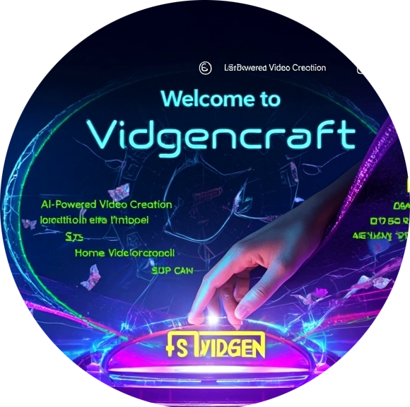
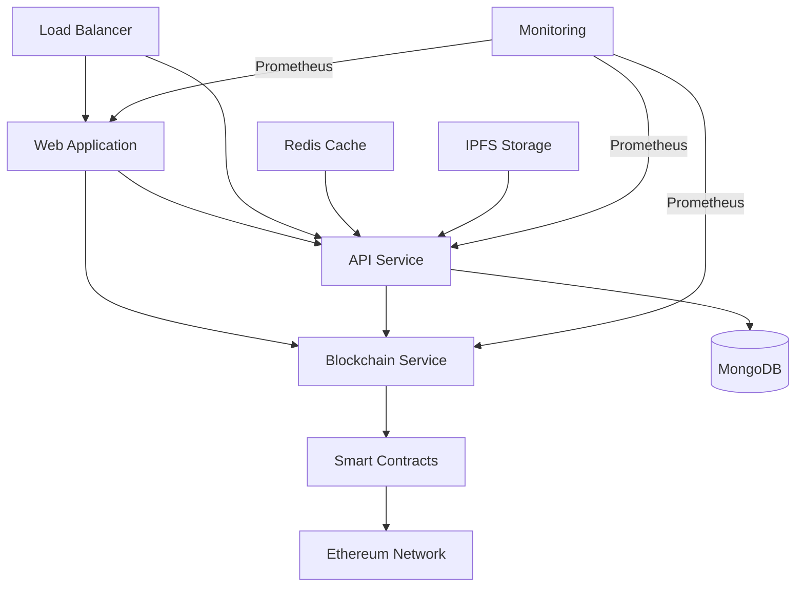
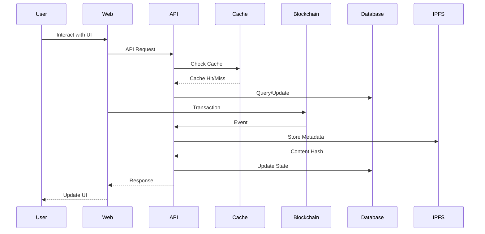

# Vidgencraft

<div align="center">
  
  
  # Vidgencraft - AI-Powered Video Creation Platform
  
  [](https://x.com/VIDGENCRAFT_)
  [](https://www.vidgencraft.xyz/)
</div>

## Overview

Vidgencraft is an AI-powered video creation and NFT platform that enables creators to generate, mint, trade, and manage digital video assets. Built with cutting-edge AI and blockchain technology, it provides a seamless experience for digital content creators and collectors.

## Features

- **NFT Creation & Management**
  - Mint new NFTs with customizable properties
  - Support for multiple file formats (images, videos, 3D models)
  - Batch minting capabilities
  - Royalty management system

- **Marketplace**
  - List NFTs for sale with flexible pricing
  - Auction system with time-based bidding
  - Secondary market trading
  - Price history and market analytics

- **User Features**
  - Secure wallet integration
  - Profile customization
  - Collection management
  - Activity tracking
  - Notification system

- **Smart Contract Features**
  - ERC-721 and ERC-1155 support
  - Upgradeable contracts
  - Multi-signature governance
  - Emergency pause functionality

## Architecture



### System Components

1. **Web Application** (Next.js + TypeScript)
   - Server-side rendering for optimal performance
   - Progressive Web App (PWA) support
   - Responsive design for all devices
   - Real-time updates via WebSocket
   - Integrated Web3 wallet support
   - Client-side caching strategies

2. **API Service** (Express.js + TypeScript)
   - RESTful endpoints with OpenAPI documentation
   - JWT-based authentication
   - Rate limiting and request validation
   - Caching layer with Redis
   - Background job processing
   - Automated API testing

3. **Blockchain Service**
   - Smart contract interaction management
   - Transaction monitoring and retry mechanism
   - Gas price optimization
   - Event processing and webhooks
   - Multi-chain support
   - Contract upgrade management

4. **Infrastructure**
   - Docker containerization
   - Kubernetes orchestration
   - Automated CI/CD pipeline
   - Monitoring and alerting
   - Automated backups
   - Disaster recovery procedures

## Technology Stack

### Frontend
- **Framework**: Next.js 14
- **Language**: TypeScript 5.0
- **UI Library**: Chakra UI
- **State Management**: Redux Toolkit
- **Web3**: ethers.js
- **Testing**: Jest, React Testing Library

### Backend
- **Framework**: Express.js
- **Language**: TypeScript
- **Database**: MongoDB
- **Caching**: Redis
- **Queue**: Bull
- **Testing**: Jest, Supertest

### Blockchain
- **Network**: Ethereum
- **Development**: Hardhat
- **Testing**: Waffle
- **Client**: Web3.js
- **Standards**: ERC-721, ERC-1155

### Infrastructure
- **Containerization**: Docker
- **Orchestration**: Kubernetes
- **CI/CD**: GitHub Actions
- **Monitoring**: Prometheus, Grafana
- **Logging**: ELK Stack
- **Storage**: IPFS

## Project Structure

```
vidgencraft/
├── apps/
│   ├── web/                 # Next.js web application
│   │   ├── src/
│   │   │   ├── components/  # Reusable UI components
│   │   │   ├── contexts/    # React contexts
│   │   │   ├── hooks/      # Custom React hooks
│   │   │   ├── pages/      # Next.js pages
│   │   │   ├── services/   # API services
│   │   │   ├── styles/     # Global styles
│   │   │   └── utils/      # Utility functions
│   │   └── public/         # Static assets
│   ├── api/                 # Express.js API server
│   │   ├── src/
│   │   │   ├── controllers/# Route controllers
│   │   │   ├── middleware/ # Custom middleware
│   │   │   ├── models/     # Database models
│   │   │   ├── routes/     # API routes
│   │   │   ├── services/   # Business logic
│   │   │   └── utils/      # Utility functions
│   │   └── tests/          # API tests
│   └── blockchain/          # Blockchain service
│       ├── contracts/      # Smart contracts
│       ├── scripts/        # Deployment scripts
│       └── test/          # Contract tests
├── shared/
│   ├── ui/                 # Shared UI components
│   │   ├── components/     # Base components
│   │   └── theme/         # Theme configuration
│   └── utils/              # Shared utilities
│       ├── blockchain/     # Blockchain utilities
│       └── validation/     # Validation schemas
├── docs/                   # Documentation
│   ├── api/               # API documentation
│   ├── contracts/         # Smart contract docs
│   └── deployment/        # Deployment guides
└── scripts/               # Utility scripts
    ├── deploy/           # Deployment scripts
    └── test/            # Test scripts
```

## Data Flow



## Getting Started

### Prerequisites

- Node.js 16+
- Yarn 1.22+
- Docker 20.10+
- MongoDB 5.0+
- Redis 6.2+

### Installation

1. Clone the repository:
```bash
git clone https://github.com/VIDGENCRAFT/Vidgencraft.git
cd vidgencraft
```

2. Install dependencies:
```bash
yarn install
```

3. Set up environment variables:
```bash
# Copy environment files
cp apps/web/.env.example apps/web/.env
cp apps/api/.env.example apps/api/.env
cp apps/blockchain/.env.example apps/blockchain/.env
```

4. Start development services:
```bash
# Start infrastructure services
docker-compose up -d

# Start development servers
yarn dev
```

### Environment Setup

Required environment variables for each service:

#### Web Application
```env
NEXT_PUBLIC_API_URL=http://localhost:4000
NEXT_PUBLIC_BLOCKCHAIN_URL=http://localhost:8545
NEXT_PUBLIC_IPFS_GATEWAY=http://localhost:8080
```

#### API Service
```env
PORT=4000
MONGODB_URI=mongodb://localhost:27017/vidgencraft
REDIS_URL=redis://localhost:6379
JWT_SECRET=your-secret-key
```

#### Blockchain Service
```env
NETWORK=localhost
PRIVATE_KEY=your-private-key
INFURA_PROJECT_ID=your-infura-id
```

## Development

### Running Tests

```bash
# Run all tests
yarn test

# Run specific workspace tests
yarn workspace @vidgencraft/web test
yarn workspace @vidgencraft/api test
yarn workspace @vidgencraft/blockchain test

# Run with coverage
yarn test --coverage
```

### Code Quality

```bash
# Run linter
yarn lint

# Run type checking
yarn type-check

# Format code
yarn format
```

### Building for Production

```bash
# Build all packages
yarn build

# Build specific workspace
yarn workspace @vidgencraft/web build
yarn workspace @vidgencraft/api build
yarn workspace @vidgencraft/blockchain build
```

## Deployment

### Using Docker Compose

```bash
# Production deployment
docker-compose -f docker-compose.prod.yml up -d
```

### Manual Deployment

1. Build the applications:
```bash
yarn build
```

2. Start the services:
```bash
yarn start
```

### Cloud Deployment

Supported cloud providers:
- AWS (Amazon Web Services)
- Google Cloud Platform
- Microsoft Azure
- Digital Ocean

Deployment guides for each provider are available in the [deployment documentation](docs/deployment/).

## Monitoring

### Available Metrics

- Application Performance
- System Resources
- Blockchain Network Status
- User Activity
- Error Rates

### Logging

- Application logs via ELK Stack
- Transaction logs on blockchain
- Access logs via Nginx

## Contributing

Please read [CONTRIBUTING.md](CONTRIBUTING.md) for details on our code of conduct and the process for submitting pull requests.

## Security

For security issues, please refer to our [Security Policy](SECURITY.md).

## API Documentation

Detailed API documentation can be found in [API.md](docs/API.md).

## Roadmap

- Q2 2024
  - Multi-chain support
  - Advanced analytics dashboard
  - Mobile application release
  - Governance token launch

- Q3 2024
  - Layer 2 integration
  - AI-powered features
  - Social features
  - Marketplace improvements

- Q4 2024
  - Cross-chain bridge
  - DAO implementation
  - Staking mechanisms
  - Enhanced security features

## Community

- [Twitter](https://x.com/VIDGENCRAFT_)
- [Website](https://www.vidgencraft.xyz/)
- [GitHub](https://github.com/VIDGENCRAFT/Vidgencraft)

## License

This project is licensed under the MIT License - see the [LICENSE](LICENSE) file for details. 