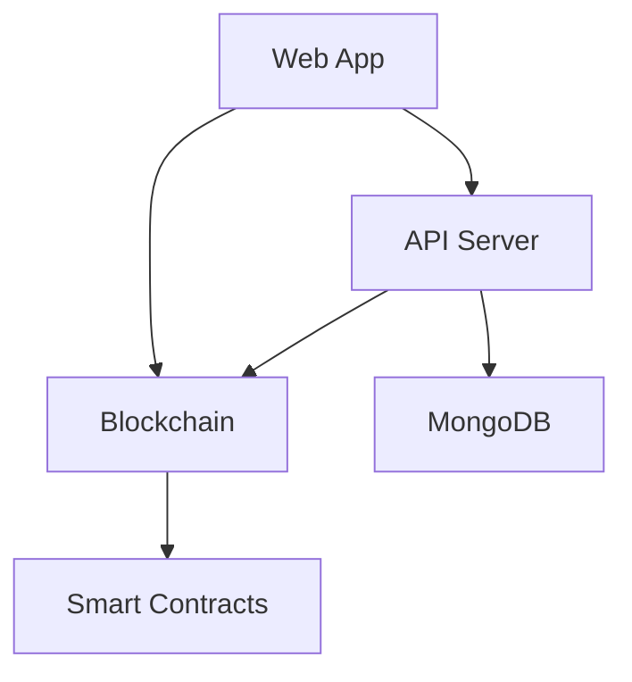

# Technical Architecture

## Overview

Vidgencraft is a decentralized platform built using a modern tech stack:

- Frontend: Next.js with TypeScript
- Backend: Express.js with TypeScript
- Blockchain: Ethereum/Hardhat
- Database: MongoDB
- Infrastructure: Docker & Kubernetes

## System Components

### 1. Web Application (`apps/web`)

The web application is built with:
- Next.js for server-side rendering
- Chakra UI for component library
- Web3.js for blockchain interaction
- TypeScript for type safety

Key features:
- User authentication
- NFT marketplace
- Wallet integration
- Profile management

### 2. API Server (`apps/api`)

The API server provides:
- RESTful endpoints
- JWT authentication
- MongoDB integration
- Rate limiting
- Request validation

Key features:
- User management
- NFT metadata
- Transaction history
- Analytics

### 3. Blockchain Integration (`apps/blockchain`)

Handles all blockchain interactions:
- Smart contract deployment
- Transaction management
- Event listening
- Gas optimization

Key features:
- Token management
- NFT minting
- Marketplace operations
- Governance

### 4. Shared Libraries

#### UI Components (`shared/ui`)
- Reusable React components
- Theme system
- Animation utilities
- Form components

#### Utilities (`shared/utils`)
- API clients
- Type definitions
- Helper functions
- Constants

## Data Flow



## Security Architecture

1. Authentication
   - JWT tokens
   - Wallet signatures
   - Session management

2. Authorization
   - Role-based access
   - Smart contract ownership
   - API permissions

3. Data Protection
   - Data encryption
   - HTTPS/SSL
   - Input validation

## Deployment Architecture

```
[Client] -> [CloudFlare] -> [Load Balancer]
                                  |
                    --------------------------------
                    |              |               |
              [Web Server]    [API Server]    [Blockchain Node]
                    |              |               |
              [Next.js SSR]   [Express]      [Ethereum Node]
                                  |
                            [MongoDB]
```

## Development Workflow

1. Local Development
   ```bash
   yarn dev
   ```

2. Testing
   ```bash
   yarn test
   ```

3. Deployment
   ```bash
   yarn build
   docker-compose up
   ```

## Performance Considerations

1. Frontend
   - Code splitting
   - Image optimization
   - Caching strategies
   - SSR/SSG optimization

2. Backend
   - Database indexing
   - Request caching
   - Connection pooling
   - Load balancing

3. Blockchain
   - Gas optimization
   - Batch transactions
   - Event filtering
   - State management

## Monitoring and Logging

1. Application Monitoring
   - Error tracking
   - Performance metrics
   - User analytics
   - System health

2. Infrastructure Monitoring
   - Server metrics
   - Database performance
   - Network status
   - Resource usage

## Future Considerations

1. Scalability
   - Horizontal scaling
   - Microservices
   - Sharding
   - Load distribution

2. Features
   - Mobile app
   - Social features
   - Advanced analytics
   - AI integration 